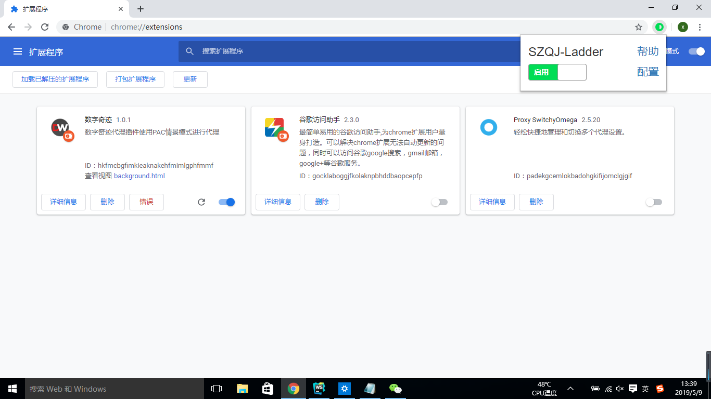
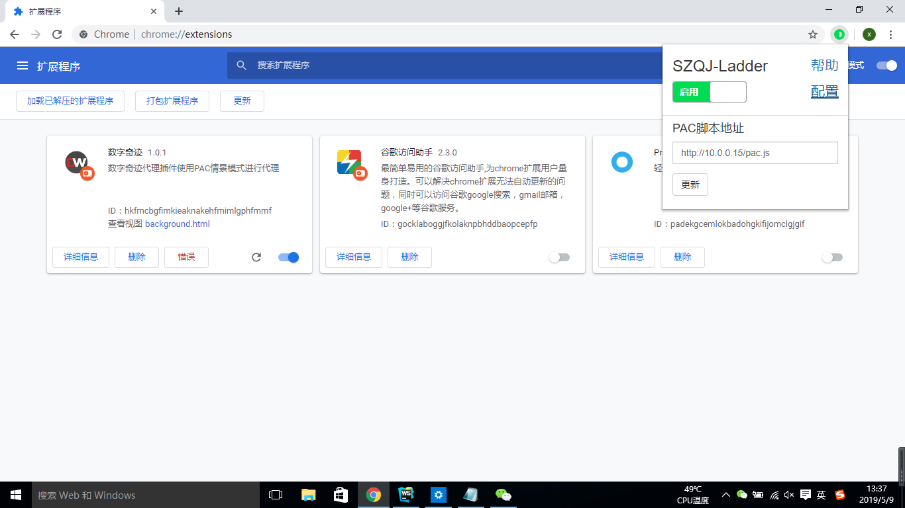

# DW-Ladder 使用教程
## 一、添加DW插件
### 1、打开扩展程序

如图1，在浏览器中-->工具列表-->更多工具列表-->扩展程序,点击扩展程序进入图2所示扩展程序界面。

图1

### 2、开启开发者模式

如图2，在扩展程序界面，点击右上角“开发者模式”开关，开启开发者模式。

图2

### 3、添加扩展程序

拖拽已经解压缩的插件文件夹或者.crx格式文件到图3所示页面。

图3

拖拽会弹出图4所示提示界面，点击确定即可

图4

至此，DW插件添加完毕

## 二、DW插件使用
### 1、插件界面

如图7，点击浏览器右上角DW插件的图标，展示我们的插件界面。在插件界面可以执行相应功能，添加扩展程序后第一次点击时会新建一个默认PAC脚本地址为`http://xx.xx.xx.xx/pac.js`的PAC情景模式。另外，默认应用的是停用代理（直接连接模式）。点击滑块按钮（停用代理模式下默认显示停用）即可启动我们插件的代理功能，再次点击，将不使用代理直接连接。

图7

### 2、启动代理

如图8，点击滑块按钮，启动PAC情景模式后，自动关闭插件界面，并且DW插件图标由灰色变为彩色。

图8

### 3、配置更新

如图9，点击配置，显示插件界面的下半部分——配置界面，如图11（第一次点击后都自动隐藏该配置界面）。

图9

如图10，在PAC脚本地址输入框内输入新的PAC脚本地址，之后点击“更新”（一定要输入正确的PAC脚本地址，否则会在更新按钮的右侧提示更新失败）。

图10

如图12，点击更新后，在右下角会显示更新结果。如果更新有问题则会显示更新失败（鼠标悬浮在“更新失败”上可以查看更新失败原因）。如果没有问题则显示更新成功，更新成功将会自动应用新的PAC脚本地址的代理，更新失败将不会应用新的PAC脚本地址的代理，并且输入框内会返回原来成功代理的PAC脚本地址。

图12
