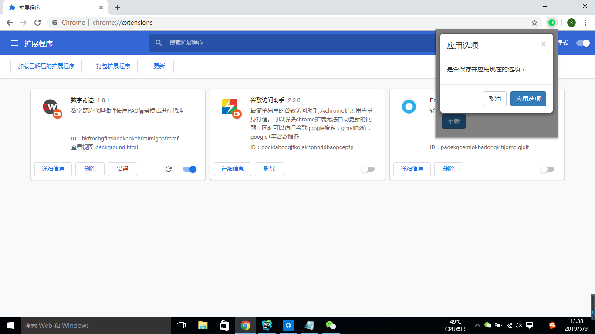
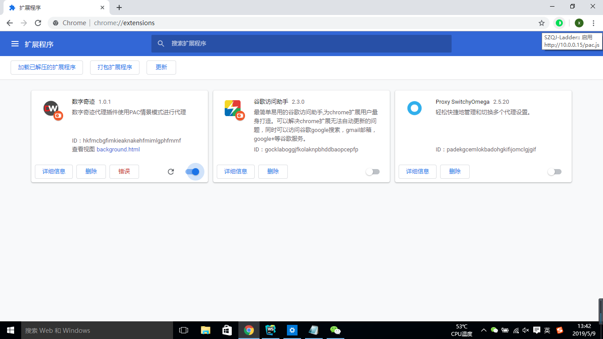

# DW-Ladder 使用教程
## 一、添加DW插件
### 1、打开扩展程序

如图1，在浏览器中-->工具列表-->更多工具列表-->扩展程序,点击扩展程序进入图二所示扩展程序界面。

图1

### 2、开启开发者模式

如图2，在扩展程序界面，点击右上角“开发者模式”开关，开启开发者模式。

图2

### 3、加载扩展程序

点击图3中左上角“加载已解压的扩展程序”，弹出图4文件夹选择弹窗，选择已经解压的扩展程序文件夹，这里演示的扩展程序文件夹是《demo》，点击“选择文件夹”，完成添加扩展程序的操作。

图3

图4

### 4、插件开启与关闭

如图5，在扩展程序界面，可以查看到我们DW插件已经添加。浏览器右上角书签图标的右边会多出一个图标，那个灰色圆形加半圆空白的图标就是我们DW插件的图标。如图5，点击插件的右下角的开关，可以控制我们DW插件的开启与关闭。

图5

如图6，我们DW插件处于关闭状态（不使用该插件），浏览器右上角我们的插件图标消失。要使用我们的插件就要重复图5操作，开启插件。

图6

## 二、DW插件使用
### 1、插件界面

如图7，点击浏览器右上角DW插件的图标，展示我们的插件界面。在插件界面可以执行相应功能，添加扩展程序后第一次点击时会新建一个默认PAC脚本地址为`http://10.0.0.15/pac.js`的PAC情景模式。另外，默认应用的是停用代理（直接连接模式）。点击滑块按钮（停用代理模式下默认显示停用）即可启动我们插件的代理功能，再次点击，将不使用代理直接连接。

图7

### 2、启动代理

如图8，点击滑块按钮，启动PAC情景模式后，自动关闭插件界面，并且DW插件图标由灰色变为绿色。

图8

### 3、配置更新

如图9，点击配置，显示插件界面的下半部分——配置界面，如图11（第一次点击后都自动隐藏该配置界面）。

图9

如图10，在PAC脚本地址输入框内输入新的PAC脚本地址，之后点击“更新”，弹出图11弹窗（如果PAC脚本地址输入框内的PAC脚本地址未改变，将不会弹出该弹窗）。

图10

如图11，点击应用选项即更新PAC脚本地址，更新完成后会显示如图12界面。

图11

如图12，点击应用选项后，在右下角会显示更新结果。如果更新有问题则会显示更新失败（鼠标悬浮在“更新失败”上可以查看更新失败原因）。如果没有问题则显示更新成功，更新成功将会自动应用新的PAC脚本地址的代理，更新失败将不会应用新的PAC脚本地址的代理，并且输入框内会返回原来成功代理的PAC脚本地址。

图12

### 4、代理模式查看

如图13，将鼠标悬浮在我们DW的图标上会显示现在的代理模式——启用（使用PAC脚本地址的代理）/停用（不适用代理，直接连接）。

图13

