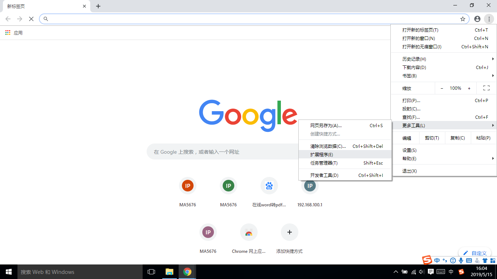
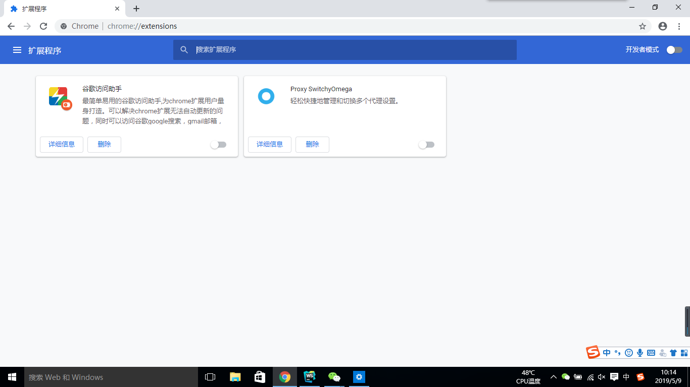
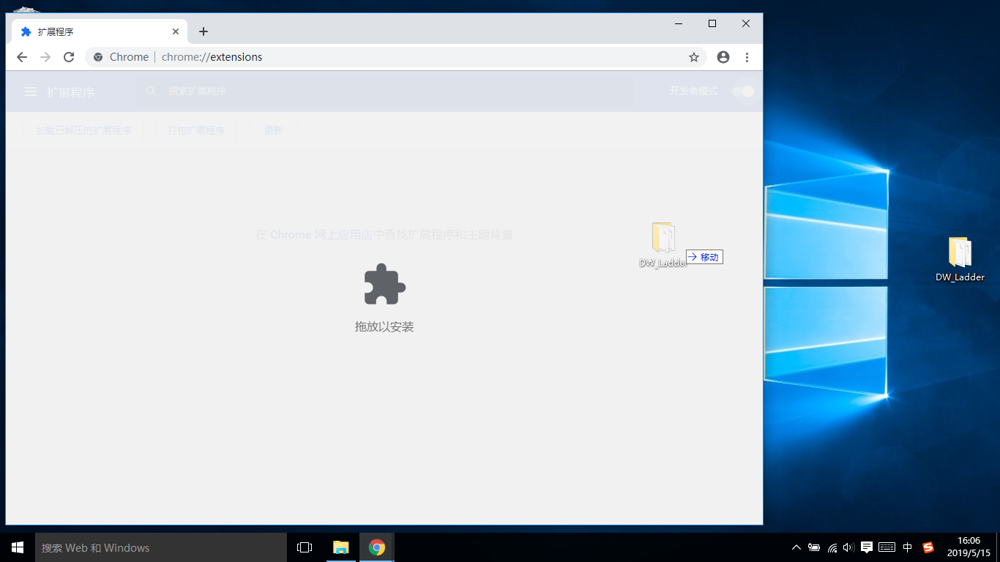
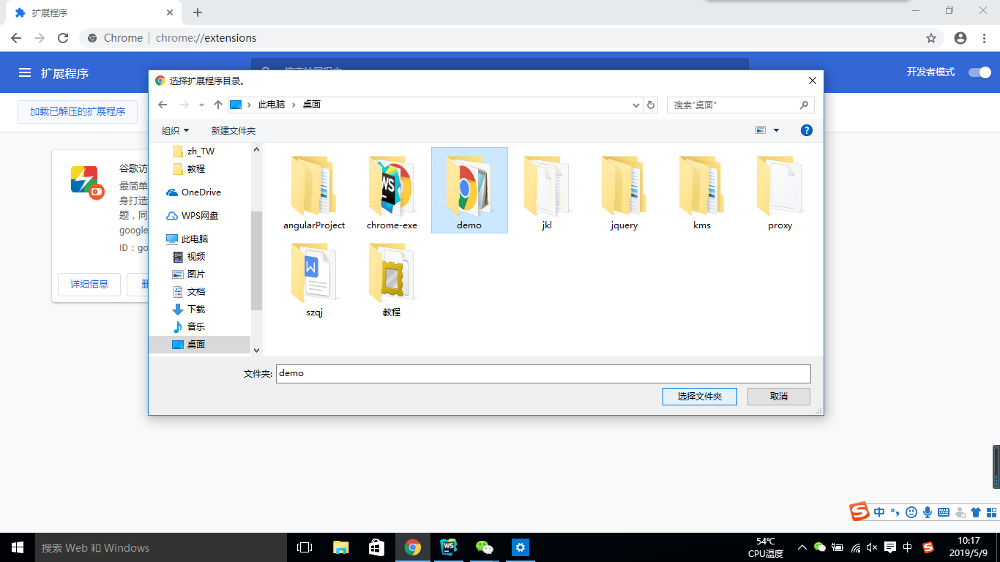
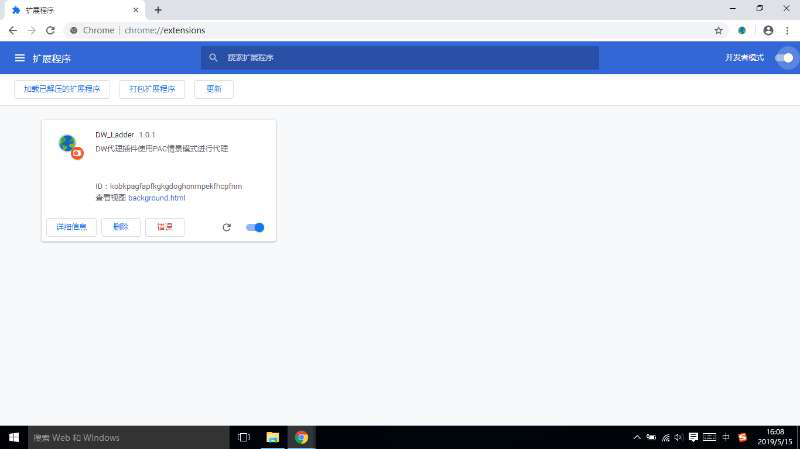
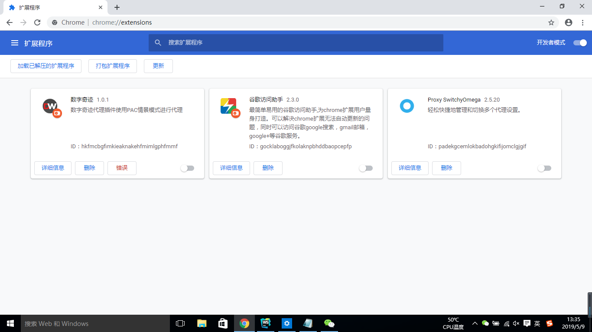
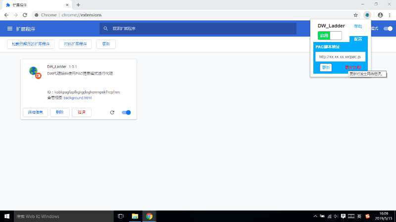
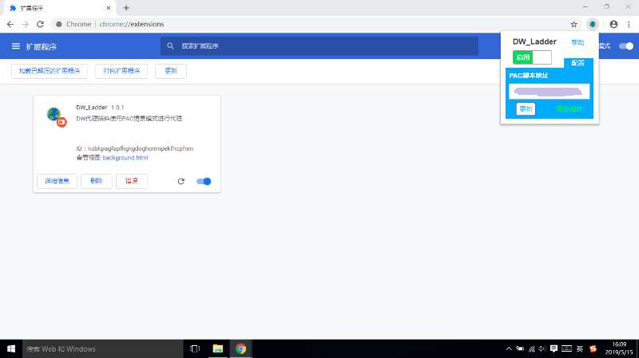

# DW-Ladder 使用教程
## 一、添加DW插件
### 1、打开扩展程序

如图1，在浏览器中-->工具列表-->更多工具列表-->扩展程序,点击扩展程序进入图2所示扩展程序界面。

图1

### 2、开启开发者模式

如图2，在扩展程序界面，点击右上角“开发者模式”开关，开启开发者模式。

图2

### 3、添加扩展程序

如图3，拖拽已经解压缩的插件文件夹即DW_Ladder文件夹到扩展程序页面。

图3

至此，DW插件添加完毕

## 二、DW插件使用
### 1、插件界面

如图4，点击浏览器右上角DW插件的图标，展示我们的插件界面。在插件界面可以执行相应功能，添加扩展程序后第一次点击时会新建一个默认PAC脚本地址为`http://xx.xx.xx.xx/pac.js`的PAC情景模式。另外，默认应用的是停用代理（直接连接模式）。点击滑块按钮（停用代理模式下默认显示停用）即可启动我们插件的代理功能，再次点击，将不使用代理直接连接。

图4

### 2、启动代理

如图5，点击滑块按钮，启动PAC情景模式后，自动关闭插件界面，并且DW插件图标由灰色变为彩色。

图5

### 3、配置更新

如图6，点击配置，显示插件界面的下半部分——配置界面。

图6

如图7，在PAC脚本地址输入框内输入新的PAC脚本地址，之后点击“更新”（一定要输入正确的PAC脚本地址，否则会在更新按钮的右侧提示更新失败），图7为更新失败的显示。

图7

图8为更新成功的显示。

图8
